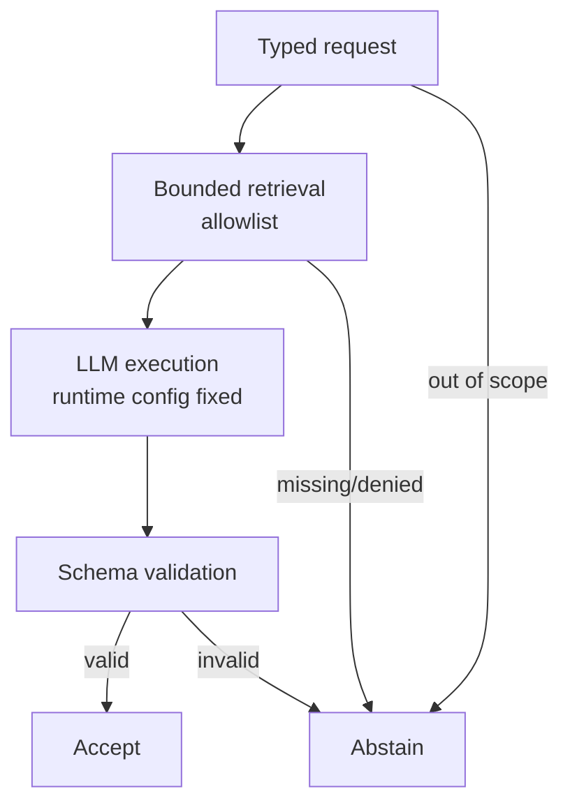

# Interpretive agentic reference — executable proof (non-normative)

This repository provides a **minimal executable reference pipeline** demonstrating how
**constraintive governance** operates as a **runtime substrate** for **interpretive governance**
in **agentic-closed** systems.

This is **not** a product, not a framework, and not a certification tool.

## What this demonstrates

A single pipeline with four non-negotiable properties:

1. **Bounded retrieval** (allowlisted sources only)
2. **Fixed inference configuration** (runtime parameters are set by the orchestrator)
3. **Schema-validated output** (reject invalid outputs)
4. **Policy-driven abstention** (legitimate non-response when conditions fail)

The purpose is to show that constraintive governance is **not a prompt technique**.
It is a **runtime configuration and enforcement layer**.

## What this does not claim

- No claim of correctness, completeness, or safety.
- No claim that a model “follows” governance.
- No claim that outputs are “approved”.
- No claim that this implementation is production-ready.

## Regime boundary

- **Web-open**: constraintive governance is inapplicable (no runtime control).
- **Agentic-closed**: constraintive governance is applicable (runtime control exists).

This repository is explicitly scoped to **agentic-closed** systems.

See:
- `docs/regime-boundary.md`
- `USAGE.md` (doctrinal usage notice)
- `docs/allowlist-maintenance.md` (non-normative operational notes)

## Architecture (single pipeline)



Typed request
  → bounded retrieval (allowlist)
  → LLM execution (runtime parameters fixed)
  → schema validation
  → accept OR abstain

See: `docs/architecture.md`

## Relationship to the manifest

This repository is a **non-normative reference implementation**.
The normative definition of Interpretive Governance is maintained in:

https://github.com/GautierDorval/interpretive-governance-manifest

This repository must not redefine that manifest.

## Where Layer 1 shows up (interpretive typing)

The interpretive typing primitives (observed / derived / inferred / unknown) are expressed here as:

- a **strict output schema**: `configs/output_schema.json`
- a governed output model: `src/types.py`
- schema validation / rejection logic: `src/validator.py`
- explicit legitimate non-response: `configs/abstention_policy.json`

## Quickstart

### 1) Setup

Python 3.11+ recommended.

```bash
pip install -r requirements.txt
```

### 2) Run in mock mode (no API required)

```bash
python -m src.main --request examples/requests/company_profile.json --mock
```

Note: mock mode demonstrates enforcement mechanics only. It does not represent provider latency, cost, failures, or behavior variability.

### 3) Run with a real LLM adapter (optional)

The adapter contract is defined in `src/llm_adapter.py`.
A minimal contract explanation is in `docs/llm-adapter-contract.md`.

You can load an adapter class using:

```bash
python -m src.main --request examples/requests/company_profile.json --adapter your_module:YourAdapter
```

Notes:
- The orchestrator still binds runtime parameters (`configs/runtime.json`).
- Output must be strict JSON matching `configs/output_schema.json`.

## Core files

- `configs/runtime.json` — runtime constraints (temperature, top_p, max_tokens)
- `configs/retrieval_allowlist.json` — allowed sources for retrieval
- `configs/output_schema.json` — strict output schema (observed / derived / inferred / unknown)
- `configs/abstention_policy.json` — legitimate non-response conditions

## Abstention (legitimate non-response)

The abstention policy is configured in `configs/abstention_policy.json`.

By default, the pipeline abstains if any of the following conditions are true:

- required sources are missing or denied by the allowlist,
- sources are conflicting (stubbed in this reference implementation),
- the request is out of scope (minimal example rule in `src/pipeline.py`),
- the model output is invalid JSON or fails schema validation.

Abstention is represented as:

- `abstained: true` in the governed output,
- an explicit message (default: `LEGITIMATE_NON_RESPONSE`) inside `unknown`.

## Examples

- Allowlisted retrieval sources: `examples/sources/`
- Typed requests: `examples/requests/`

## CI and tests

- JSON configs and example requests are validated on CI.
- The pipeline is covered by a minimal `unittest` suite (`tests/`).

Run locally:

```bash
python -m unittest discover -s tests -v
```

## License

MIT License. See: `LICENSE`
